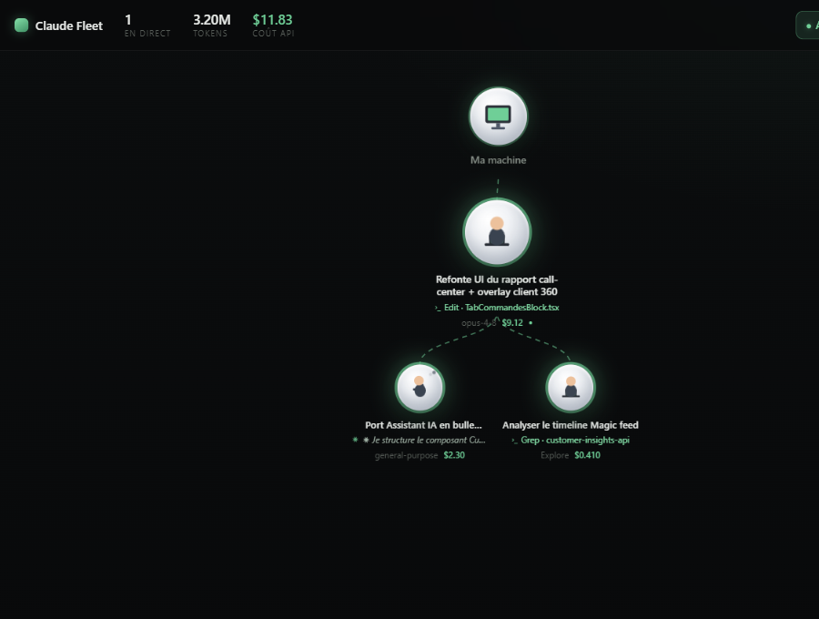

# Claude Fleet — moniteur de sessions Claude Code

> Visualise en temps réel **toutes tes sessions Claude Code et leurs sous-agents** sous forme de **bulles flottantes hiérarchiques**, avec les **tokens et le coût $ en direct**, et la possibilité de **reprendre la main** sur n'importe quelle session.

Extension VS Code, look « Apple » sobre / high-tech. Une grosse bulle = une session principale ; les petites bulles reliées en dessous = ses sous-agents (`Task`/`Agent`/`Workflow`). Chaque bulle dit **ce qu'elle est en train de faire**, **combien de tokens** elle a consommé et **combien ça coûte** en $ API. Clique une bulle pour voir le détail et le flux en direct.



---

## Comment ça marche

Claude Code écrit chaque session dans `~/.claude/projects/<projet>/<sessionId>.jsonl`, et chaque sous-agent dans `<sessionId>/subagents/agent-<id>.jsonl` (+ un `.meta.json` qui décrit l'agent). Claude Fleet **observe ces fichiers** (lecture seule, incrémentale — il ne relit jamais tout le fichier, juste les nouveaux octets) et en déduit :

- **Sessions & sous-agents** en cours, avec leur **hiérarchie** (session → agents).
- **Ce qu'ils font maintenant** : dernière réflexion / texte / outil en cours (`Bash`, `Edit`, `Grep`, lancement d'un agent…).
- **Tokens** par catégorie (input, output, cache write 5 min / 1 h, cache read).
- **Coût $ API** calculé depuis le modèle (`opus` / `sonnet` / `haiku` / `fable`) et le détail des tokens. Tarifs **configurables**.
- **Statut** : 🟢 en direct (modifié il y a < 30 s) · 🟡 inactif · ⚪ terminé.

Tout est **local** : aucune donnée ne sort de ta machine, aucune clé API requise (la lecture des tokens vient des transcripts, pas de l'API).

## Fonctionnalités

- 🫧 **Orbes flottants reliés en arbre** : une racine « Ma machine » → les sessions → leurs sous-agents, connectés par des liens animés (le flux « coule » sur les liens des agents actifs). Tout flotte doucement et reste toujours connecté.
- 🧑‍💻 **Personnage animé dans chaque orbe** selon l'état : tape sur un laptop quand ça travaille, bulles de pensée quand ça réfléchit, assis quand ça attend, ✓ quand c'est fini.
- 🖱️ **Déplaçables** : maintiens le clic sur un orbe pour le repositionner (il s'épingle). Un clic simple ouvre le détail ; cliquer « Ma machine » lance une nouvelle session.
- 💸 **Coût $ et tokens en direct**, qui défilent (compteurs tweenés). Total flotte agrégé dans la barre du haut.
- 🔎 **Panneau détail** (clic sur une bulle) : décomposition coût / tokens, contexte (dossier, branche git, durée, nb de messages) et **flux en direct** des derniers événements.
- ⛓️ **Filtre** « Ce projet » / « Tous » pour ne voir que les sessions du workspace courant.
- 🎮 **Contrôle des sessions** (voir ci-dessous).
- 🖥️ Disponible en **vue latérale** (barre d'activité) **et** en **plein écran** (commande `Claude Fleet: Ouvrir le moniteur`).

## Contrôler une session

Une extension externe ne peut pas « injecter » des ordres dans un process Claude Code déjà lancé. Claude Fleet utilise donc le mécanisme officiel et honnête : **reprendre la main**.

- **↩ Reprendre la main** : ouvre un terminal `claude --resume <sessionId>` dans le bon dossier. Tu retombes dans la session interactive : tu peux **l'interrompre** (Échap / Ctrl-C), **la modifier** (taper de nouvelles instructions) ou la laisser continuer. Pour un sous-agent, c'est la **session parente** qui est reprise.
- **+ Session** : lance une nouvelle session Claude Code (terminal), avec un message de départ optionnel.
- **Copier resume** : copie `claude --resume <id>` dans le presse-papier.
- **Transcript** / **Révéler** : ouvre le `.jsonl` brut ou le montre dans l'explorateur de fichiers.

> Les sessions reprises/lancées depuis Fleet portent le badge **« pilotée »**.

## Installation (dev)

```bash
git clone https://github.com/Anilito1/claude-fleet.git
cd claude-fleet
npm install
npm run build
```

Puis dans VS Code : ouvre le dossier et appuie sur **F5** (« Run Claude Fleet ») → une fenêtre Extension Development Host s'ouvre avec l'icône **Claude Fleet** dans la barre d'activité à gauche.

Pour générer un `.vsix` installable :

```bash
npm i -g @vscode/vsce
vsce package
# puis: VS Code > Extensions > … > Install from VSIX
```

## Réglages

| Réglage | Défaut | Rôle |
|---|---|---|
| `claudeFleet.projectsDir` | `~/.claude/projects` | Dossier des transcripts Claude Code. |
| `claudeFleet.activeWindowMinutes` | `180` | Fenêtre « récent » : une session modifiée dans ce délai est affichée. |
| `claudeFleet.liveWindowSeconds` | `30` | Fenêtre « en direct » (pastille verte pulsée). |
| `claudeFleet.pollIntervalMs` | `1500` | Cadence de rafraîchissement du watcher. |
| `claudeFleet.claudeCommand` | `claude` | Commande CLI pour lancer / reprendre des sessions. |
| `claudeFleet.pricing` | `{}` | Surcharge des tarifs $/1M tokens par famille de modèle. |

### Tarifs

Par défaut, Claude Fleet applique la structure de tarifs publique d'Anthropic (cache write 5 min = 1,25× input, 1 h = 2× input, cache read = 0,1× input). Tu peux tout surcharger :

```jsonc
"claudeFleet.pricing": {
  "opus":   { "input": 15, "output": 75, "cacheWrite5m": 18.75, "cacheWrite1h": 30, "cacheRead": 1.5 },
  "sonnet": { "input": 3,  "output": 15, "cacheWrite5m": 3.75,  "cacheWrite1h": 6,  "cacheRead": 0.3 },
  "haiku":  { "input": 1,  "output": 5,  "cacheWrite5m": 1.25,  "cacheWrite1h": 2,  "cacheRead": 0.1 }
}
```

> Les transcripts très volumineux (> 12 Mo) sont lus depuis leur fin pour ne pas bloquer l'éditeur : leur coût est alors marqué **≈** (partiel). Les sessions actives normales sont exactes.

## Architecture

```
src/
  extension.ts   Contrôleur : commandes, vue/panneau, diffusion d'état
  watcher.ts     Scan + lecture incrémentale (offset/fichier) + hiérarchie + statuts
  parser.ts      Parsing d'une ligne JSONL : usage tokens, titre, activité
  pricing.ts     Tarifs par modèle + calcul du coût
  launcher.ts    Terminaux : nouvelle session / reprendre la main
  panel.ts       Webview (vue latérale + plein écran) + CSP
  types.ts       Modèle de données partagé host ↔ webview
media/
  main.js        Rendu des bulles, connecteurs SVG, compteurs, drawer
  style.css      Thème glassmorphism sobre + animations
```

## Limites connues

- Lecture **seule** des transcripts : pas de pilotage direct d'un process en cours (par design) — voir « Reprendre la main ».
- Le coût $ est une **estimation** basée sur des tarifs configurables, pas une facturation réelle.
- Détection « en direct » par fraîcheur de fichier (mtime), pas par socket.

## Licence

MIT © Anilito1
